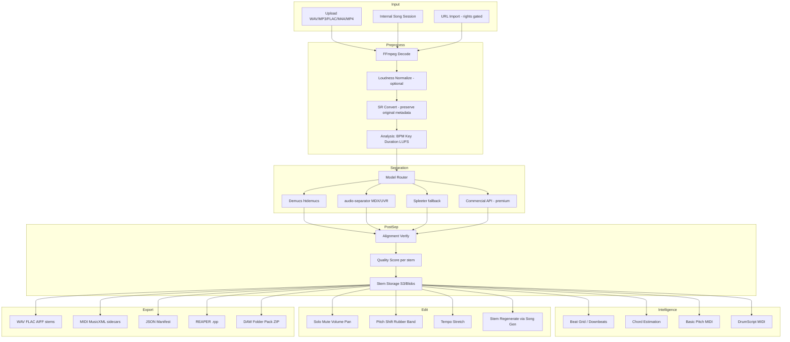

# Stem Extraction + DAW Export Module
## Technical Proposal for the Universal Agentic Music Production OS

**Version:** 1.0  
**Date:** 2026-06-29  
**Status:** Plan — implementation not started

---

## Table of Contents

1. [Executive Summary](#1-executive-summary)
2. [Competitive Feature Breakdown](#2-competitive-feature-breakdown)
3. [Recommended Architecture](#3-recommended-architecture)
4. [DAW Interoperability Plan](#4-daw-interoperability-plan)
5. [Data Model](#5-data-model)
6. [API Design](#6-api-design)
7. [Agentic Workflow Design](#7-agentic-workflow-design)
8. [Model Selection Recommendation](#8-model-selection-recommendation)
9. [Implementation Plan](#9-implementation-plan)
10. [Risks and Limitations](#10-risks-and-limitations)
11. [Testing and Evaluation](#11-testing-and-evaluation)
12. [Final Recommendation](#12-final-recommendation)

---

## 1. Executive Summary

### Recommendation

Build a **modular, offline-first stem extraction pipeline** inside the Universal Agentic Music Production OS, with optional commercial API fallback for premium tiers.

```
Upload / Generated Song
  → FFmpeg Decode + Normalize
  → Musical Analysis (BPM, key, loudness, structure)
  → Stem Separation (model router)
  → Quality Scoring + Alignment Verification
  → Edit Layer (solo/mute/pitch/tempo/regenerate)
  → Transcription Sidecars (MIDI, chords, beat grid)
  → DAW Export Package (WAV ZIP + manifest + REAPER .rpp)
```

### Why this architecture

| Requirement | Architectural answer |
|---|---|
| Agentic song system integration | Stems become first-class project assets with JSON manifests the LLM can read, score, and revise |
| Moises/LALAL parity for musicians | 4-stem default, karaoke/acapella, BPM/key, pitch/tempo controls |
| Producer handoff | Aligned 24-bit WAV stems + REAPER session + tempo/key metadata |
| Cost control | Self-hosted Demucs/audio-separator on GPU workers; LALAL.AI/AudioShake only for premium |
| Legal safety | Never promise perfect separation; rights-check gate on upload; model license audit trail |
| Extensibility | Model router supports 2/4/6/10-stem modes without rewriting the pipeline |

### Default stack (MVP → production)

| Layer | Tool | Role |
|---|---|---|
| Decode / convert | [FFmpeg](https://ffmpeg.org/) | Universal audio/video ingest |
| Default separator | [adefossez/demucs](https://github.com/adefossez/demucs) `htdemucs` | 4-stem baseline |
| Power separator | [audio-separator](https://github.com/nomadkaraoke/python-audio-separator) + UVR/MDX-Net | 2-stem vocal isolation, 6+ stems |
| Fast fallback | [Spleeter](https://github.com/deezer/spleeter) | CPU-friendly degraded mode |
| ONNX inference (optional) | [demucs-onnx](https://github.com/StemSplit/demucs-onnx) | Lighter deploy, no PyTorch at runtime |
| Audio-to-MIDI | [Basic Pitch](https://github.com/spotify/basic-pitch) | Melodic stem transcription |
| BPM / beat / key | [Essentia](https://github.com/MTG/essentia) + [librosa](https://github.com/librosa/librosa) | Rhythm + tonal analysis |
| Chords | [madmom](https://github.com/CPJKU/madmom) + chroma templates | Beat-aligned chord charts |
| Drum MIDI | [DrumScript](https://github.com/DrumScript/DrumScript) | Deterministic drum transcription |
| Pitch / tempo edit | Rubber Band (commercial license) or librosa phase-vocoder fallback | High-quality transposition |
| DAW session | [reathon](https://github.com/jamesb93/reathon) | REAPER `.rpp` generation |
| Premium API | [LALAL.AI API](https://www.lalal.ai/api/v1/docs/) / [AudioShake](https://www.audioshake.ai/) | Enterprise-quality fallback |

---

## 2. Competitive Feature Breakdown

### Product comparison

| Feature | Moises | LALAL.AI | Suno-style | MusicFlow-style | **Our target** |
|---|---|---|---|---|---|
| 2-stem (vocal/instrumental) | ✅ | ✅ | ✅ | ✅ | ✅ Must-have |
| 4-stem (v/d/b/other) | ✅ | ✅ | ✅ | ✅ | ✅ Must-have |
| 6–10 stem modes | ✅ Pro (custom) | ✅ up to 10 | Limited | Partial | ✅ Phase 2–3 |
| Drum sub-stems (kick/snare/hat) | ✅ Pro | Partial | ❌ | ❌ | Nice-to-have (Phase 3) |
| BPM detection | ✅ | ✅ | Partial | ✅ | ✅ Must-have |
| Key detection | ✅ | ✅ | Partial | ✅ | ✅ Must-have |
| Chord detection | ✅ | ❌ | ❌ | Partial | ✅ Phase 3 |
| Pitch shift / tempo change | ✅ | ✅ | ❌ | ✅ | ✅ Phase 3 |
| Lyric transcription | ✅ | ❌ | ❌ | ❌ | Nice-to-have |
| AI stem regeneration | ✅ AI Studio | ❌ | ✅ (native gen) | ✅ | ✅ Phase 4 (via song gen) |
| DAW export | WAV/M4A/MP3 | WAV | Stems in-app | Partial | ✅ **Differentiator: REAPER + manifest** |
| API for integration | Partner tier | ✅ Public REST | ❌ | ❌ | ✅ Must-have |
| Agentic revision loop | ❌ | ❌ | ❌ | ❌ | ✅ **Key differentiator** |
| Scorecard + A&R review | ❌ | ❌ | ❌ | ❌ | ✅ **Key differentiator** |
| Cross-song memory (RAG) | ❌ | ❌ | ❌ | ❌ | ✅ **Key differentiator** |

### Must-have (MVP parity)

- Upload or accept internally generated audio
- 4-stem extraction with aligned WAV output
- Solo/mute stem player
- Karaoke (instrumental) and acapella (vocals-only) one-click exports
- BPM + key detection
- ZIP stem package with JSON manifest
- Job queue with status polling

### Nice-to-have (competitive parity)

- 6-stem and 10-stem modes
- Chord chart with bar/beat alignment
- Pitch shift and tempo change without artifacts
- MIDI sidecars for melodic stems
- Background vocal isolation
- Drum sub-stem separation

### Differentiators (agentic OS advantage)

- **Revision loop:** extract → score → recommend edits → re-export
- **Hybrid rebuild:** combine best drums from V2 + best atmosphere from V1
- **Structured manifests** the agent can reason over (not just audio files)
- **Rights-aware workflow:** confirm source and rights before processing
- **DAW-native handoff:** REAPER project + README import guide per target DAW
- **Model provenance:** every stem tagged with separator model, version, confidence

---

## 3. Recommended Architecture

### System diagram



### Layer specifications

#### Input Layer

| Source | Format | Notes |
|---|---|---|
| File upload | WAV, MP3, FLAC, AIFF, M4A, MP4 | Max duration configurable (default 10 min MVP, 30 min prod) |
| Internal session | Reference to generated song asset | Skip re-upload; use canonical mix |
| URL import | HTTP(S) stream | **Rights gate required**; no YouTube ripping without license |

#### Preprocessing

```python
# Pseudocode — preprocessing contract
{
  "input_path": "...",
  "decoded_wav": "48kHz/24-bit working copy",
  "original_metadata": { "sample_rate", "bit_depth", "channels", "duration", "codec" },
  "analysis": {
    "bpm": 98.0,
    "bpm_confidence": 0.87,
    "key": "A minor",
    "key_confidence": 0.72,
    "lufs_integrated": -14.2,
    "peak_db": -0.3
  }
}
```

- **FFmpeg** for decode: `ffmpeg -i input -ar 44100 -ac 2 -sample_fmt s32 working.wav`
- Preserve original file untouched; all processing on working copy
- Optional EBU R128 loudness normalization to -16 LUFS for preview; export both normalized and unnormalized

#### Stem Separation

| Mode | Stems | Default model | Fallback |
|---|---|---|---|
| `2-stem` | vocals, instrumental | `UVR_MDXNET_KARA_2.onnx` via audio-separator | Spleeter 2-stem |
| `4-stem` | vocals, drums, bass, other | `htdemucs` | `htdemucs_ft` (quality), Open-Unmix `umx` (speed) |
| `6-stem` | + guitar, piano | `htdemucs_6s` | MDXC multi-stem via audio-separator |
| `10-stem` | custom instrument set | LALAL.AI API or AudioShake | Cascaded 4-stem + specialist models |
| `vocal-isolation` | vocals only | `UVR-MDX-NET-Voc_FT` | Demucs vocals stem |

**Alignment contract:** All stems MUST share identical `sample_rate`, `channels`, `duration_samples`, `start_time=0`. Post-separation validation sums stems and compares to mix for phase/duration drift.

#### Musical Analysis

| Task | Primary | Fallback | Output |
|---|---|---|---|
| BPM | Essentia `RhythmExtractor2013` | librosa `beat_track` | `bpm`, `beat_positions[]`, `downbeats[]` |
| Key | Essentia `KeyExtractor` | librosa chroma + Krumhansl | `key`, `scale`, `confidence` |
| Chords | madmom `DeepChromaChordRecognitionProcessor` | librosa chroma template match | `chords[]` with bar times |
| Vocal MIDI | Basic Pitch on vocals stem | — | `vocals.mid` |
| Bass MIDI | Basic Pitch on bass stem | — | `bass.mid` |
| Drum MIDI | DrumScript on drums stem | Omnizart drum model | `drums.mid` |

#### Editing Layer

| Operation | Engine | Notes |
|---|---|---|
| Solo/mute | Web Audio / server-side mixdown | Non-destructive; stored as edit state |
| Volume/pan | Per-stem gain + pan in manifest | Applied at export or preview |
| Pitch shift | Rubber Band (licensed) or librosa | ±12 semitones; preserve tempo |
| Tempo change | Rubber Band or librosa time_stretch | ±50% MVP; preserve pitch |
| Key transpose | Pitch shift by semitone interval | Whole-project or per-stem |
| Stem regenerate | Song generation agent | Replace stem via inpainting/regen — Phase 4 |
| Section edit | Bar-aligned regions in manifest | Mute/solo/reorder by section |

#### Export Layer

| Export type | Priority | Format |
|---|---|---|
| Stem ZIP | P0 | `stems/*.wav` + `manifest.json` + `README_DAW_IMPORT.md` |
| Karaoke / acapella | P0 | Pre-mixed WAV |
| MIDI sidecars | P1 | `.mid` per transcribed stem |
| REAPER project | P1 | `.rpp` with one track per stem |
| Ableton folder | P1 | Stems + `project_info.json` (tempo/key) |
| Logic/GarageBand folder | P2 | Same as Ableton + import instructions |
| MusicXML | P2 | Chord chart export |
| AAF | P3 | Feasibility only — see Section 4 |
| Tempo map | P1 | JSON + embedded in manifest |

---

## 4. DAW Interoperability Plan

### Universal strategy (works everywhere)

Every export package includes:

```
export_package/
├── README_DAW_IMPORT.md
├── manifest.json
├── stems/
│   ├── vocals.wav          # 24-bit, 44100 Hz, stereo, start=0
│   ├── drums.wav
│   ├── bass.wav
│   └── other.wav
├── mixes/
│   ├── instrumental.wav    # karaoke
│   └── acapella.wav
├── midi/                   # optional
│   ├── vocals.mid
│   └── drums.mid
├── metadata/
│   ├── tempo_map.json
│   ├── beat_grid.json
│   └── chords.json
└── sessions/               # optional
    └── project.rpp
```

**Rules:**
1. All stems: same sample rate (44100), bit depth (24), channel layout (stereo), start time (0.0)
2. Broadcast WAV (BWF) with `bext` chunk for title/description optional
3. `manifest.json` is the source of truth for tempo, key, markers
4. Include `README_DAW_IMPORT.md` with per-DAW steps

### Per-DAW guidance

| DAW | Import method | Warp/quantize | Notes |
|---|---|---|---|
| **Ableton Live** | Drag stems folder; set project tempo from manifest | Enable warp if tempo editing needed | Include `Ableton_Import.txt` with suggested track order |
| **FL Studio** | File → Import → Wave; set BPM in project | Use time stretching for tempo match | Stem tracks map 1:1 |
| **Logic Pro** | File → Import → Audio; create tracks | Flex Time optional | Include key signature from manifest |
| **GarageBand** | Same as Logic (simplified) | Limited flex | 4-stem max recommended for mobile |
| **REAPER** | Open `.rpp` directly | Item properties from manifest | **Best auto-session target** |
| **Pro Tools** | Import audio to tracks | Elastic Audio optional | AAF possible Phase 3 via pyaaf2 |
| **Cubase** | Import audio tracks | Set tempo from manifest | |
| **Studio One** | Drag-and-drop stems | Tempo from manifest | |
| **BandLab** | Upload stems individually | Browser-based; WAV only | ZIP with clear naming |

### REAPER `.rpp` generation (first auto-session)

Use [reathon](https://github.com/jamesb93/reathon) to emit:

```python
from reathon.nodes import Project, Track, Item, Source

project = Project(
    Track(name="Vocals", children=[
        Item(position=0, length=duration, source=Source("stems/vocals.wav"))
    ]),
    Track(name="Drums", children=[...]),
    Track(name="Bass", children=[...]),
    Track(name="Other", children=[...]),
)
project.write("sessions/project.rpp")
```

Embed project tempo and time signature from analysis. Add markers for detected sections.

### AAF/OMF feasibility

| Format | Feasibility | Recommendation |
|---|---|---|
| **AAF** | Medium — [pyaaf2](https://github.com/markreidvfx/pyaaf2) can embed WAV and create multi-track mobs | Phase 3 for Pro Tools / post-production users |
| **OMF** | Low — legacy, limited Python support | Skip; direct WAV import preferred |
| **OpenTimelineIO** | Medium — [otio-aaf-adapter](https://github.com/OpenTimelineIO/otio-aaf-adapter) | Use if timeline editing grows |

**Risk:** AAF embedding is complex; WAV + manifest is more reliable for MVP.

### VST/AU plugin strategy (optional, Phase 5)

- Not required for MVP
- Consider a thin VST that loads manifest + stems from a folder
- Higher value: REST API + desktop helper app that watches export folder

---

## 5. Data Model

### Project manifest schema (v1)

```json
{
  "$schema": "https://music-os.example/schemas/stem-project/v1.json",
  "schema_version": "1.0.0",
  "project_id": "proj_8f3a2b1c",
  "parent_song_id": "song_loc_drop_v3",
  "title": "Location Drop - Mix V3",
  "created_at": "2026-06-29T12:00:00Z",
  "updated_at": "2026-06-29T12:45:00Z",
  "status": "ready",
  "rights": {
    "source_type": "user_upload",
    "rights_confirmed": true,
    "confirmed_by": "user_123",
    "confirmed_at": "2026-06-29T12:00:00Z"
  },
  "source": {
    "file": "source/original.mp3",
    "sha256": "abc123...",
    "codec": "mp3",
    "duration_seconds": 183.4,
    "sample_rate": 44100,
    "bit_depth": 16,
    "channels": 2
  },
  "musical": {
    "bpm": 98.0,
    "bpm_confidence": 0.87,
    "key": "A",
    "scale": "minor",
    "key_display": "A minor",
    "key_confidence": 0.72,
    "time_signature": [4, 4],
    "lufs_integrated": -14.2
  },
  "separation": {
    "mode": "4-stem",
    "model_id": "htdemucs",
    "model_version": "4.0.1",
    "provider": "self_hosted",
    "job_id": "sep_job_9x2k",
    "completed_at": "2026-06-29T12:30:00Z",
    "alignment_verified": true,
    "sum_to_mix_correlation": 0.98
  },
  "stems": [
    {
      "id": "stem_vocals",
      "name": "vocals",
      "display_name": "Vocals",
      "file": "stems/vocals.wav",
      "start_time": 0.0,
      "duration_seconds": 183.4,
      "sample_rate": 44100,
      "bit_depth": 24,
      "channels": 2,
      "lufs": -18.4,
      "peak_db": -3.1,
      "confidence": 0.91,
      "quality_score": 8.2,
      "bleed_notes": "slight hi-hat bleed in chorus",
      "midi_file": "midi/vocals.mid",
      "edit_state": {
        "muted": false,
        "solo": false,
        "volume_db": 0.0,
        "pan": 0.0,
        "pitch_semitones": 0,
        "tempo_ratio": 1.0
      }
    },
    {
      "id": "stem_drums",
      "name": "drums",
      "display_name": "Drums",
      "file": "stems/drums.wav",
      "confidence": 0.88,
      "quality_score": 7.9,
      "midi_file": "midi/drums.mid"
    },
    {
      "id": "stem_bass",
      "name": "bass",
      "display_name": "Bass",
      "file": "stems/bass.wav",
      "confidence": 0.85,
      "quality_score": 7.5,
      "midi_file": "midi/bass.mid"
    },
    {
      "id": "stem_other",
      "name": "other",
      "display_name": "Other",
      "file": "stems/other.wav",
      "confidence": 0.79,
      "quality_score": 7.0
    }
  ],
  "tempo_map": [
    { "time_seconds": 0.0, "bpm": 98.0 }
  ],
  "beat_grid": {
    "beats": [0.0, 0.612, 1.224],
    "downbeats": [0.0, 2.449]
  },
  "markers": [
    { "id": "m1", "name": "Intro", "start_bar": 1, "end_bar": 8, "start_seconds": 0.0, "end_seconds": 19.6 },
    { "id": "m2", "name": "Verse 1", "start_bar": 9, "end_bar": 24, "start_seconds": 19.6, "end_seconds": 58.8 }
  ],
  "chords": [
    { "start_seconds": 0.0, "end_seconds": 3.9, "chord": "Am", "confidence": 0.82 },
    { "start_seconds": 3.9, "end_seconds": 7.8, "chord": "F", "confidence": 0.79 }
  ],
  "derived_mixes": {
    "instrumental": "mixes/instrumental.wav",
    "acapella": "mixes/acapella.wav"
  },
  "exports": [
    {
      "id": "exp_001",
      "type": "zip_stems",
      "format": "zip",
      "file": "exports/stems_v1.zip",
      "created_at": "2026-06-29T12:45:00Z",
      "target_daw": "universal"
    },
    {
      "id": "exp_002",
      "type": "reaper_project",
      "format": "rpp",
      "file": "exports/project_v1.rpp",
      "target_daw": "reaper"
    }
  ],
  "scorecard": {
    "overall": 7.8,
    "vocal_clarity": 8.5,
    "drum_punch": 7.9,
    "bass_definition": 7.2,
    "artifact_level": 2.1,
    "revision_notes": "Drums strong; bass has bleed from keys in bridge"
  },
  "agent_memory_refs": [
    "ref_approved_stem_pack_trap_soul_98bpm",
    "ref_avoid_muddy_low_end_v2"
  ]
}
```

### Database tables (Postgres)

| Table | Purpose |
|---|---|
| `stem_projects` | Project metadata, status, user_id |
| `stem_jobs` | Async separation/analysis/export jobs |
| `stem_assets` | File paths, checksums, stem metadata |
| `stem_edits` | Versioned edit state per stem |
| `stem_exports` | Export history and download URLs |
| `stem_scorecards` | A&R quality scores per version |

---

## 6. API Design

Base URL: `https://api.music-os.example/v1`

### Endpoints

| Method | Path | Description |
|---|---|---|
| `POST` | `/stem-projects` | Create project + upload audio |
| `GET` | `/stem-projects/{id}` | Get project + manifest |
| `POST` | `/stem-projects/{id}/separate` | Start separation job |
| `GET` | `/stem-jobs/{job_id}` | Poll job status |
| `GET` | `/stem-projects/{id}/stems` | List stems with metadata |
| `GET` | `/stem-projects/{id}/stems/{stem_id}/audio` | Stream stem audio |
| `PATCH` | `/stem-projects/{id}/stems/{stem_id}` | Update edit state (mute/volume/pan) |
| `POST` | `/stem-projects/{id}/transpose` | Transpose key (whole or per-stem) |
| `POST` | `/stem-projects/{id}/tempo` | Change tempo |
| `POST` | `/stem-projects/{id}/transcribe` | Generate MIDI from stem(s) |
| `POST` | `/stem-projects/{id}/regenerate-stem` | Replace stem via song gen agent |
| `POST` | `/stem-projects/{id}/export` | Create DAW export package |
| `GET` | `/stem-exports/{export_id}` | Download export |
| `PUT` | `/stem-projects/{id}/manifest` | Save full project state |

### Example: Create separation job

**Request**
```http
POST /v1/stem-projects/proj_8f3a/separate
Content-Type: application/json

{
  "mode": "4-stem",
  "model": "htdemucs",
  "quality": "balanced",
  "options": {
    "normalize_loudness": false,
    "detect_bpm_key": true,
    "generate_midi": false
  }
}
```

**Response**
```json
{
  "job_id": "sep_job_9x2k",
  "status": "queued",
  "estimated_seconds": 45,
  "poll_url": "/v1/stem-jobs/sep_job_9x2k"
}
```

### Example: Job status

```json
{
  "job_id": "sep_job_9x2k",
  "status": "processing",
  "progress": 0.65,
  "stage": "separating",
  "stages_completed": ["decode", "analyze"],
  "stages_remaining": ["separate", "align_verify", "score", "store"]
}
```

### Example: Export for Ableton

```http
POST /v1/stem-projects/proj_8f3a/export
Content-Type: application/json

{
  "target_daw": "ableton",
  "include": ["stems", "manifest", "midi", "mixes"],
  "format": {
    "audio": "wav",
    "bit_depth": 24,
    "normalized": false
  },
  "transpose": {
    "semitones": -2,
    "scope": "all"
  }
}
```

**Response**
```json
{
  "export_id": "exp_003",
  "status": "processing",
  "poll_url": "/v1/stem-exports/exp_003"
}
```

### GraphQL alternative (optional)

For the agentic frontend, a single `stemProject(id)` query returning the full manifest + presigned URLs reduces round-trips. REST is sufficient for MVP.

---

## 7. Agentic Workflow Design

### Stem Extraction + DAW Export Agent

```
Role: Stem Extraction + DAW Export Agent
Context: Universal Agentic Music Production OS
```

**Per-request procedure:**

1. **Interpret intent** — extraction mode, target DAW, edits, output type
2. **Confirm source + rights** — block if unlicensed URL or missing confirmation
3. **Choose stem mode** — 2/4/6/10-stem or specialist (vocal-isolation)
4. **Route model** — quality vs speed vs CPU constraints
5. **Run pipeline** — decode → separate → align → analyze
6. **Score stems** — populate scorecard; flag bleed/artifacts
7. **Apply edits** — mute vocals for karaoke, transpose, etc.
8. **Generate exports** — ZIP, REAPER, MIDI sidecars
9. **Explain limitations** — never promise studio multitrack quality
10. **Save state** — manifest, model metadata, agent memory refs

### Example command handling

| User command | Agent actions |
|---|---|
| "Extract vocals and drums from this song" | `mode=custom`, stems=[vocals, drums], run 4-stem then mute/export subset |
| "Put this in D minor and export for Ableton" | Analyze key → compute transpose → apply → export with `target_daw=ableton` |
| "Remove the vocals and give me a karaoke version" | `mode=2-stem` or mute vocals → export `instrumental.wav` |
| "Turn the bassline into MIDI" | Run Basic Pitch on bass stem → `bass.mid` |
| "Separate into 10 stems and create a REAPER project" | Route to LALAL/API or cascaded models → `mode=10-stem` → emit `.rpp` |
| "Transpose the whole track down 2 semitones without changing tempo" | Rubber Band pitch shift all stems −2 semitones, `tempo_ratio=1.0` |

### Integration with Universal OS loop

```
Song DNA → Generation → Stem Breakdown → Audio Analysis → A&R Scorecard → Revision
                              ↑                                    ↓
                         Stem Agent ←―――――――――――――――――――― Export Agent
```

The Stem Agent reads prior scorecards and approved stem references from RAG before recommending model/mode.

---

## 8. Model Selection Recommendation

### Tool evaluation matrix

| Tool | Quality | Stems | Speed | GPU | License | Maintained | API | Best for |
|---|---|---|---|---|---|---|---|---|
| [htdemucs](https://github.com/adefossez/demucs) | ★★★★☆ | 4 (+6s) | Medium | Preferred | MIT | ✅ Active fork | Python/CLI | **Default 4-stem** |
| [htdemucs_ft](https://github.com/adefossez/demucs) | ★★★★★ | 4 | Slow (4×) | Preferred | MIT | ✅ | Python/CLI | **High-quality offline** |
| [demucs-onnx](https://github.com/StemSplit/demucs-onnx) | ★★★★☆ | 4, 6 | Fast | CPU/GPU | MIT | ✅ New (2026) | Python/CLI | Lightweight deploy |
| [audio-separator](https://github.com/nomadkaraoke/python-audio-separator) | ★★★★☆ | 2–10+ | Fast–Medium | Optional | MIT | ✅ Active | Python/CLI | **Power-user / vocal** |
| MDX-Net (via UVR) | ★★★★☆ | 2, 4 | Fast | ONNX CPU ok | Model-dependent | Via UVR | Via audio-separator | **Vocal isolation** |
| [Spleeter](https://github.com/deezer/spleeter) | ★★★☆☆ | 2, 4, 5 | Fast | CPU ok | MIT | ⚠️ Slow updates | Python | **CPU fallback** |
| [Open-Unmix](https://github.com/sigsep/open-unmix-pytorch) | ★★★☆☆ | 4 | Fast | Preferred | MIT code / **NC weights** | ✅ | Python | Research only; `umxl` NC |
| [facebookresearch/demucs](https://github.com/facebookresearch/demucs) | — | — | — | — | MIT | ❌ **Archived** | — | **Do not use** |
| [Basic Pitch](https://github.com/spotify/basic-pitch) | ★★★★☆ | N/A | Fast | CPU ok | Apache-2.0 | ✅ | Python | **Audio-to-MIDI** |
| [Essentia](https://github.com/MTG/essentia) | ★★★★☆ | N/A | Fast | CPU | **AGPL-3.0** | ✅ | Python/C++ | BPM/key (AGPL caveat) |
| [librosa](https://github.com/librosa/librosa) | ★★★☆☆ | N/A | Fast | CPU | ISC | ✅ | Python | Analysis fallback |
| [madmom](https://github.com/CPJKU/madmom) | ★★★★☆ | N/A | Medium | CPU | **CC BY-NC-SA** | ⚠️ Stale | Python | Chords (NC license) |
| [LALAL.AI API](https://www.lalal.ai/api/v1/docs/) | ★★★★★ | up to 10 | Fast (cloud) | N/A | Commercial | ✅ | REST | **Premium API** |
| [AudioShake](https://www.audioshake.ai/) | ★★★★★ | Multi + dialogue | Fast (cloud) | N/A | Enterprise | ✅ | REST | Enterprise/post |

### Recommendations

| Role | Choice | Why |
|---|---|---|
| **Default open-source** | `htdemucs` via [adefossez/demucs](https://github.com/adefossez/demucs) | Best quality/speed/license balance; 4-stem standard |
| **High-quality offline** | `htdemucs_ft` or MDX-Net HQ via audio-separator | Audible improvement for release handoff |
| **Fast model** | `htdemucs` or MDX-Net ONNX | Near-real-time on GPU; ONNX on CPU |
| **CPU-friendly fallback** | Spleeter 4-stem or demucs-onnx | When no GPU; degraded but functional |
| **Vocal isolation** | `UVR_MDXNET_KARA_2.onnx` or `UVR-MDX-NET-Voc_FT` | Industry-standard karaoke quality |
| **Commercial/API** | LALAL.AI API (music) / AudioShake (enterprise) | 10-stem, SLA, no GPU ops |

### License warnings

| Tool | Risk |
|---|---|
| Open-Unmix `umxl` weights | CC BY-NC-SA — **not for commercial product** |
| madmom | CC BY-NC-SA — research/non-commercial |
| Essentia | AGPL-3.0 — SaaS deployment requires legal review |
| Rubber Band | GPL — **commercial license required** for proprietary SaaS |
| UVR model weights | Community-trained; verify per-model terms |
| Original Meta demucs repo | Archived — use adefossez fork only |

---

## 9. Implementation Plan

### Phase 1: MVP (foundation)

**Goal:** Moises-style 4-stem workflow with ZIP export

| Task | Details |
|---|---|
| Audio upload endpoint | WAV, MP3, FLAC; store in S3/Supabase |
| FFmpeg decode service | Normalize to 44.1kHz stereo working copy |
| Demucs worker | `htdemucs` 4-stem; GPU queue (Celery/BullMQ) |
| Alignment verification | Duration match, sample count, correlation check |
| BPM + key detection | librosa first; Essentia if license cleared |
| Manifest v1 | JSON schema as defined above |
| ZIP export | Aligned 24-bit WAV stems + manifest |
| Stem player UI | Solo/mute per stem |
| Karaoke/acapella buttons | Pre-mix derived outputs |
| Job status API | Poll separation progress |

**Exit criteria:** User uploads song → receives 4 stems in ZIP within 2× realtime on GPU.

### Phase 2: DAW-ready export

| Task | Details |
|---|---|
| JSON manifest v1.1 | Beat grid, markers, scorecard |
| MIDI sidecars | Basic Pitch on vocals + bass |
| REAPER `.rpp` export | reathon-based session generator |
| Ableton/Logic folder export | Stems + `project_info.json` + README |
| Model router | Support 2-stem and 6-stem modes |
| audio-separator integration | MDX-Net vocal models |

### Phase 3: Advanced music intelligence

| Task | Details |
|---|---|
| Beat grid + downbeats | Essentia RhythmExtractor2013 |
| Chord detection | madmom or librosa template (license-dependent) |
| Drum MIDI | DrumScript on drums stem |
| Pitch/key transposition | Rubber Band (licensed) or librosa fallback |
| Tempo change | Rubber Band time stretch |
| 10-stem mode | LALAL.AI API integration |

### Phase 4: Agentic editing

| Task | Details |
|---|---|
| NL stem editing | "mute drums in chorus" → marker-aware edits |
| Stem replacement | Route to song generation agent |
| Remix suggestions | Agent proposes stem combinations from scorecard |
| Section arrangement | Bar-based mute/solo/reorder |
| Revision loop integration | Stem scorecard feeds back to Song DNA agent |

### Phase 5: Production optimization

| Task | Details |
|---|---|
| GPU autoscaling queue | Separate pools for separate vs analyze |
| Result caching | Hash source audio → skip re-separation |
| Batch processing | Catalog / album mode |
| User stem library | Cross-project stem reuse |
| demucs-onnx path | Reduce worker image size |
| Cost optimization | Route premium users to API; free tier to Spleeter |
| AAF export | pyaaf2 for Pro Tools users |

### Suggested repo structure

```
music-os/
├── apps/
│   ├── web/                    # Next.js command center
│   └── api/                    # FastAPI or Node API
├── services/
│   ├── stem-worker/            # Python: separation + analysis
│   ├── export-worker/          # Python: DAW package builder
│   └── ffmpeg-service/         # Decode/normalize microservice
├── packages/
│   ├── stem-manifest/          # JSON schema + validators
│   ├── model-router/           # Model selection logic
│   └── daw-export/             # REAPER, ZIP, folder exporters
├── schemas/
│   └── stem-project-v1.json
└── docs/
    └── STEM_EXTRACTION_DAW_EXPORT_PLAN.md
```

---

## 10. Risks and Limitations

| Risk | Impact | Mitigation |
|---|---|---|
| **Separation artifacts** | Bleed, phasing, "underwater" vocals | Quality scorecard; model fallback; set user expectations |
| **Not studio multitracks** | User expects perfect isolation | Clear copy: "AI approximation, not original stems" |
| **Copyright** | Uploading protected masters | Rights confirmation gate; ToS; no unauthorized URL ripping |
| **Model licensing** | NC/GPL/AGPL models in SaaS | Audit table; use MIT models default; commercial licenses for Rubber Band/Essentia |
| **GPU costs** | $0.01–0.10+ per song at scale | Cache; tiered quality; CPU fallback for free tier |
| **Long files** | OOM, timeouts | Chunked processing; max duration limits; streaming decode |
| **MP3 artifacts** | Worse separation on low bitrate | Warn user; prefer lossless upload |
| **Dense mixes** | Collapsed "other" stem | Recommend 6-stem or premium API |
| **Live recordings** | Bleed, room, crowd noise | Flag in scorecard; denoise pre-pass optional |
| **DAW format lock-in** | Ableton/Logic project formats proprietary | WAV + manifest universal; REAPER .rpp as open first target |
| **Pitch/tempo quality** | Artifacts on full mix vs stems | Always process per-stem; avoid librosa for final export |
| **UVR model drift** | Community models change | Pin model versions in Docker image |

---

## 11. Testing and Evaluation

### Objective metrics

| Metric | Tool | Target |
|---|---|---|
| SDR / SI-SDR | museval on MUSDB18 holdout | Match published htdemucs benchmarks |
| Stem sum correlation | Custom: `corr(mix, sum(stems))` | > 0.95 |
| Duration alignment | Sample count diff | 0 samples |
| Phase cancellation | Invert vocals + instrumental vs mix | Document residual level |
| BPM accuracy | vs annotated test set | ±2 BPM on 80% of tracks |
| Key accuracy | vs annotated test set | Correct key on 70%+ |
| MIDI F1 | vs ground truth (small set) | Establish baseline |

### Human listening tests

- 20 tracks across genres (pop, trap, rock, acoustic, EDM)
- Blind A/B: our 4-stem vs Moises vs LALAL.AI web
- Rate: vocal clarity, drum punch, artifact level, overall usability

### Export compatibility tests

| DAW | Test |
|---|---|
| REAPER | Open `.rpp` — all stems aligned, playable |
| Ableton Live 11/12 | Import folder — tempo matches |
| Logic Pro | Import — key signature correct |
| FL Studio | Import — no offset |
| BandLab | Upload stems — no sync drift |

### Performance benchmarks

| Config | Track length | Target latency |
|---|---|---|
| GPU T4 + htdemucs | 3 min | < 90 sec |
| GPU T4 + htdemucs_ft | 3 min | < 6 min |
| CPU 8-core + Spleeter | 3 min | < 3 min |
| MDX-Net ONNX CPU | 3 min | < 2 min |

### Edge case suite

- Mono input
- 32 kHz MP3 128 kbps
- Live concert recording
- Acapella (vocals only — should not hallucinate drums)
- Instrumental (no vocals)
- 30+ minute DJ mix
- Variable tempo (rubato)
- Sidechain-heavy EDM

---

## 12. Final Recommendation

### Build-this-first checklist

- [ ] **1.** Create `stem-worker` Python service with FFmpeg + Demucs (`adefossez/demucs` pinned)
- [ ] **2.** Implement upload → decode → 4-stem → align verify → store
- [ ] **3.** Add librosa BPM/key detection
- [ ] **4.** Define and validate `manifest.json` schema v1
- [ ] **5.** Build ZIP export with aligned 24-bit WAV stems
- [ ] **6.** Add karaoke (instrumental) and acapella mixdown
- [ ] **7.** Build stem player with solo/mute in web UI
- [ ] **8.** Add job queue + status API
- [ ] **9.** Integrate Stem Agent prompt into Universal OS router
- [ ] **10.** Run MUSDB18 benchmark + 10-song human listening test
- [ ] **11.** Add REAPER `.rpp` export (reathon)
- [ ] **12.** Integrate audio-separator for 2-stem vocal isolation
- [ ] **13.** Add Basic Pitch MIDI sidecars
- [ ] **14.** Legal review: Essentia AGPL, Rubber Band GPL, madmom NC
- [ ] **15.** Premium tier: LALAL.AI API fallback for 10-stem

### Stack summary

```
┌─────────────────────────────────────────────────────────┐
│  Universal Agentic Music Production OS                  │
│  ┌─────────────┐  ┌──────────────┐  ┌───────────────┐  │
│  │ Web UI      │  │ API Gateway  │  │ Agent Router  │  │
│  │ (Next.js)   │  │ (FastAPI)    │  │ (Stem Agent)  │  │
│  └──────┬──────┘  └──────┬───────┘  └───────┬───────┘  │
│         └────────────────┼──────────────────┘          │
│                          ▼                              │
│  ┌──────────────────────────────────────────────────┐  │
│  │ Job Queue (Redis/BullMQ)                          │  │
│  └──────────┬───────────────────────┬───────────────┘  │
│             ▼                       ▼                   │
│  ┌──────────────────┐   ┌──────────────────────────┐   │
│  │ stem-worker      │   │ export-worker            │   │
│  │ FFmpeg           │   │ ZIP / REAPER / MIDI      │   │
│  │ Demucs           │   │ manifest builder         │   │
│  │ librosa/Essentia │   │ README generator         │   │
│  │ Basic Pitch      │   └──────────────────────────┘   │
│  │ audio-separator  │                                   │
│  └──────────────────┘                                   │
│             ▼                                           │
│  ┌──────────────────────────────────────────────────┐  │
│  │ Storage: S3 / Supabase + Postgres metadata          │  │
│  └──────────────────────────────────────────────────┘  │
└─────────────────────────────────────────────────────────┘
```

### What NOT to build first

- AAF/OMF export
- Real-time stem separation
- VST/AU plugin
- 10-stem self-hosted (use API)
- Lyric transcription
- Custom model training

---

## Appendix A: Researched Repos and Docs

| Resource | URL | Status |
|---|---|---|
| Demucs (maintained) | https://github.com/adefossez/demucs | ✅ Use this |
| Demucs (archived) | https://github.com/facebookresearch/demucs | ❌ Archived Apr 2024 |
| demucs-onnx | https://github.com/StemSplit/demucs-onnx | ✅ New, ONNX inference |
| audio-separator | https://github.com/nomadkaraoke/python-audio-separator | ✅ Active |
| Ultimate Vocal Remover | https://github.com/Anjok07/ultimatevocalremovergui | ✅ Model source |
| Spleeter | https://github.com/deezer/spleeter | ⚠️ Maintained, dated quality |
| Open-Unmix | https://github.com/sigsep/open-unmix-pytorch | ✅ Code MIT; umxl NC |
| Basic Pitch | https://github.com/spotify/basic-pitch | ✅ Apache-2.0 |
| Essentia | https://github.com/MTG/essentia | ✅ AGPL |
| librosa | https://github.com/librosa/librosa | ✅ ISC |
| madmom | https://github.com/CPJKU/madmom | ⚠️ NC license, stale |
| Rubber Band | https://github.com/breakfastquay/rubberband | ✅ GPL / commercial |
| pyrubberband | https://github.com/bmcfee/pyrubberband | ✅ ISC wrapper |
| DrumScript | https://github.com/DrumScript/DrumScript | ✅ Open source |
| libretta | https://pypi.org/project/libretta/ | ✅ Pipeline reference |
| reathon | https://github.com/jamesb93/reathon | ✅ REAPER emit |
| reaproj | https://github.com/bkazez/reaproj | ✅ REAPER parse/edit |
| pyaaf2 | https://github.com/markreidvfx/pyaaf2 | ✅ AAF read/write |
| LALAL.AI API | https://www.lalal.ai/api/v1/docs/ | ✅ Commercial |
| AudioShake | https://www.audioshake.ai/ | ✅ Enterprise |
| Moises | https://moises.ai/ | Product reference |
| HTDemucs paper | https://arxiv.org/abs/2211.08553 | Reference |
| MUSDB18 | https://sigsep.github.io/datasets/musdb.html | Benchmark dataset |

---

## Appendix B: Agent System Prompt (copy-paste ready)

```
You are the Stem Extraction + DAW Export Agent inside the Universal Agentic Music Production OS.

Your job is to take uploaded, imported, or internally generated audio and turn it into clean, aligned, editable stems that can be used inside music editors and DAWs.

For every request:
1. Interpret the user's intent.
2. Confirm the source audio and rights status.
3. Choose the correct stem mode: 2-stem, 4-stem, 6-stem, 10-stem, or specialist mode.
4. Choose the best separator model or provider.
5. Decode and preprocess the audio.
6. Extract stems while preserving timing and sample alignment.
7. Analyze BPM, key, beat grid, loudness, and stem quality.
8. Create usable outputs: stems, karaoke version, acapella, MIDI, tempo map, chord chart, or DAW package.
9. Export for the requested editor: Ableton, FL Studio, Logic, GarageBand, REAPER, Pro Tools, Cubase, Studio One, BandLab, or universal WAV ZIP.
10. Explain limitations clearly, including artifacts, bleed, or model uncertainty.
11. Save the project state, model metadata, scorecard, and export manifest.

Default strategy:
- Use aligned 24-bit WAV stems as the universal standard.
- Use REAPER .rpp as the first generated DAW session format.
- Use JSON manifest, MIDI sidecars, tempo map, markers, and README import instructions for every export.

Never promise perfect separation. AI stem extraction creates approximations, not original studio multitracks.
```

---

*End of plan. Ready for Phase 1 implementation upon approval.*
