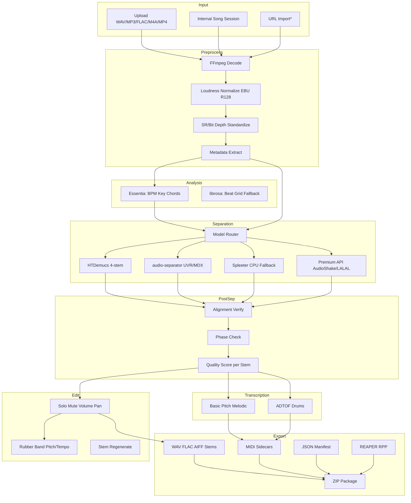

# Stem Extraction + DAW Export — Technical Proposal

**Universal Agentic Music Production OS**  
**Version:** 1.0  
**Date:** 2026-06-29  
**Status:** Plan (pre-implementation)

---

## 1. Executive Summary

This proposal designs a production-ready **Stem Extraction + Music Editor Export** module for an agentic song creation system. The module accepts uploaded, generated, or imported audio; separates it into aligned, editable stems; analyzes musical structure (BPM, key, beat grid, optional chords/MIDI); supports solo/mute/edit/transpose operations; and exports DAW-ready packages.

### Recommended architecture

```
Any Song Input (upload / generate / session / URL*)
  → FFmpeg decode + loudness normalize
  → Musical analysis (Essentia + librosa)
  → Stem separation (model router)
  → Quality scoring + alignment verification
  → Edit layer (solo/mute/volume/pan/pitch/tempo)
  → Transcription sidecars (Basic Pitch, ADTOF)
  → DAW export packager (WAV ZIP + JSON + REAPER .rpp)
```

### Why this stack

| Decision | Rationale |
|----------|-----------|
| **HTDemucs as default separator** | Best balance of open-source quality, 4-stem coverage, MIT license, and ecosystem maturity. SDR ~9.0 on MUSDB benchmarks. |
| **audio-separator + UVR/MDX-Net as power-user tier** | Access to 10+ stem types, vocal specialists, Roformer/SCNet models, and ONNX paths without maintaining UVR GUI code. |
| **Spleeter / Open-Unmix as CPU fallbacks** | Lightweight when GPU unavailable; acceptable for previews, not primary quality. |
| **Essentia + librosa for analysis** | Essentia for production-grade BPM/key/chord descriptors; librosa as fallback and for beat-grid refinement. |
| **Basic Pitch + ADTOF for MIDI** | Practical, maintained, instrument-specific transcription after stem isolation. |
| **Rubber Band for pitch/tempo edits** | Industry-standard time-stretch/pitch-shift quality for stem-level edits. |
| **Aligned 24-bit WAV + JSON manifest + REAPER .rpp** | Universal DAW import strategy; `.rpp` is programmatically generatable; AAF deferred to Phase 3+. |
| **AudioShake / LALAL.AI as premium API fallback** | Commercial quality and 10-stem coverage when GPU budget or quality SLA demands it. |

**Critical constraint:** AI stem extraction produces *approximations*, not original studio multitracks. The system must score quality, surface bleed/artifact warnings, and never promise perfection.

---

## 2. Competitive Feature Breakdown

### Product comparison

| Feature | Moises | LALAL.AI | Suno-style | MusicFlow-style | **Our target** |
|---------|--------|----------|------------|-----------------|----------------|
| Vocal isolation | ✅ Hi-Fi models | ✅ Orion v4 | ✅ Post-gen workflow | ✅ Remix input | ✅ Must-have |
| 4-stem (v/d/b/other) | ✅ | ✅ | ✅ | ✅ | ✅ Must-have |
| 6–10 stems | ✅ 7 (Pro) | ✅ 10 stems | Limited | Partial | ✅ Must-have (tiered) |
| Drum sub-stems (kick/snare/hat) | ✅ Pro modules | Partial | ❌ | ❌ | ⚡ Nice-to-have (Phase 3) |
| BPM detection | ✅ | ✅ | ✅ | ✅ | ✅ Must-have |
| Key detection | ✅ | ✅ | Partial | Partial | ✅ Must-have |
| Chord detection | ✅ | Partial | ❌ | Partial | ⚡ Nice-to-have |
| Pitch shift / tempo change | ✅ (on mix, not stems*) | ✅ | ✅ | ✅ | ✅ Must-have (Phase 3) |
| Audio-to-MIDI | ❌ | ❌ | ❌ | Partial | ⚡ Differentiator |
| DAW VST plugin | ✅ Pro VST | ✅ Pro VST | ❌ | ❌ | Phase 4+ optional |
| REAPER/DAW project export | ❌ (ZIP stems only) | ❌ | ❌ | Partial | ✅ **Differentiator** |
| Agentic NL commands | ❌ | ❌ | Partial | Partial | ✅ **Core differentiator** |
| Revision loops + scorecards | ❌ | ❌ | ❌ | ❌ | ✅ **Core differentiator** |
| Generated-song native input | ❌ | ❌ | ✅ | ✅ | ✅ Must-have |
| JSON project manifest | ❌ | ❌ | ❌ | ❌ | ✅ Differentiator |

\*Moises applies key/speed changes to the *mix export*, not individual stem files — a known user pain point.

### Must-have (MVP → Phase 2)

- Upload / internal song session input
- 2-stem and 4-stem extraction
- Aligned WAV stem ZIP export
- BPM + key detection
- Solo / mute / karaoke / acapella
- JSON manifest with model metadata
- Job queue with status API

### Nice-to-have (Phase 3–4)

- 6-stem and 10-stem modes
- Beat grid + downbeat markers
- Chord chart export
- Vocal + drum MIDI sidecars
- Key/tempo transposition per stem
- REAPER `.rpp` auto-session
- Section-based arrangement editing

### Differentiators (vs. Moises / LALAL / Suno)

1. **Agentic workflow** — natural-language stem mode selection, edit recommendations, and export targeting
2. **Loop-engineered quality** — scorecards, revision prompts, stem selection across parallel generations
3. **DAW-native packages** — manifest + tempo map + REAPER project + per-DAW README, not just loose files
4. **Generated-music-first** — stems from internal song sessions without re-upload
5. **Transparent model routing** — user/agent picks quality vs. speed; confidence metadata per stem
6. **MIDI sidecars** — bass/guitar/vocal/drum transcription after clean separation

---

## 3. Recommended Architecture

### 3.1 System diagram



\*URL import only where legally permitted; require rights attestation.

### 3.2 Input layer

| Source | Format | Notes |
|--------|--------|-------|
| File upload | WAV, MP3, FLAC, AIFF, M4A, MP4 | FFmpeg decode; preserve original metadata in manifest |
| Internal session | Reference to generated song asset | Skip re-upload; use canonical master WAV |
| URL import | HTTP(S) audio/video | Rights check + allowlist; async download job |

**Constraints:** Max duration tiered (MVP: 10 min; Pro: 30 min; Enterprise: 180 min). Max file size: 500 MB MVP, 2 GB Pro.

### 3.3 Preprocessing

```python
# Pseudocode pipeline step
def preprocess(input_path, target_sr=44100, target_bit_depth=24):
    decoded = ffmpeg_decode(input_path)          # PCM float32
    meta = extract_metadata(input_path)          # title, artist, duration, channels
    normalized = loudness_normalize(decoded, -16)  # LUFS target configurable
    resampled = resample_if_needed(normalized, target_sr)
  return resampled, meta
```

**Libraries:** [FFmpeg](https://ffmpeg.org/), [torchaudio](https://pytorch.org/audio/), [soundfile](https://github.com/bastibe/python-soundfile), [pyloudnorm](https://github.com/csteinmetz1/pyloudnorm) or FFmpeg `loudnorm` filter.

### 3.4 Stem separation layer

#### Model router logic

| Mode | Stems | Default model | Fallback |
|------|-------|---------------|----------|
| `2-stem` | vocals, instrumental | MDX-Net vocal model via audio-separator | HTDemucs 2-stem |
| `4-stem` | vocals, drums, bass, other | `htdemucs` | `htdemucs_ft` (quality), Spleeter (CPU) |
| `6-stem` | + guitar, piano | `htdemucs_6s` | UVR multi-stem |
| `10-stem` | vocals, BV, drums, bass, guitar, piano, strings, winds, synth, other | audio-separator UVR ensemble | LALAL.AI API |
| `vocal-isolation` | vocals | MDX-Net Kara / Roformer vocal | HTDemucs vocals stem |
| `drum-sub` | kick, snare, hat, cymbals, percussion | UVR drum models | Demucs drums only |

**Alignment guarantee:** All stems rendered from the same input buffer with identical sample count, `start_time: 0`, same `sample_rate`, same channel layout (stereo default). Post-separation validation rejects outputs with length mismatch > 1 sample.

### 3.5 Musical analysis layer

| Task | Primary | Fallback |
|------|---------|----------|
| BPM | Essentia `RhythmExtractor2013` | librosa beat_track + HPSS |
| Beat positions | Essentia beats + confidence | librosa onset + beat sync |
| Downbeat | madmom `DBNDownBeatTracker` (optional) | Heuristic every-4th-beat |
| Key | Essentia `Key` (profile: edma for electronic, krumhansl for pop) | librosa chroma_cqt + KS |
| Chords | Essentia `ChordsDetection` on HPCP | Chordino (legacy) |
| Loudness per stem | FFmpeg ebur128 / pyloudnorm | — |

### 3.6 Editing layer

| Operation | Tool | Scope |
|-----------|------|-------|
| Solo / mute | Internal mix matrix | Per stem |
| Volume / pan | Internal DSP | Per stem |
| Time stretch | Rubber Band R3 (`-3`) | Per stem or full mix |
| Pitch shift | Rubber Band | Per stem |
| Key transpose | Pitch shift by semitones | All stems equally |
| Tempo change | Time stretch by ratio | All stems equally |
| Stem replace | Re-run separation or inject new asset | Single stem slot |
| Section edit | Bar-aligned slice/arrange | Phase 4 |

### 3.7 Export layer

| Export type | Phase | Format |
|-------------|-------|--------|
| Stem WAV pack | 1 | 24-bit PCM WAV, aligned, ZIP |
| Normalized + raw variants | 2 | Both included in ZIP |
| JSON manifest | 2 | `manifest.json` |
| MIDI sidecars | 2–3 | `.mid` per transcribed stem |
| Tempo map | 3 | JSON + MIDI tempo events |
| Chord chart | 3 | JSON + optional MusicXML |
| REAPER project | 2 | `.rpp` with tracks + items |
| Ableton/Logic folder | 2 | Stems + `project_info.json` + README |
| AAF | 4 (experimental) | Via OTIO + pyaaf2 |
| OMF | ❌ Not recommended | Legacy, no reliable OSS writer |

---

## 4. DAW Interoperability Plan

### 4.1 Universal strategy (works everywhere)

Every export package includes:

```
export_package/
├── README_IMPORT.md          # Per-DAW instructions
├── manifest.json             # Full project metadata
├── stems/
│   ├── vocals.wav            # 24-bit, 44100 Hz, stereo, start=0
│   ├── drums.wav
│   ├── bass.wav
│   └── other.wav
├── midi/                     # Optional
│   ├── drums.mid
│   └── bass.mid
├── analysis/
│   ├── tempo_map.json
│   ├── beat_grid.json
│   └── chords.json
└── sessions/                 # Optional
    └── project.rpp
```

**Rules:**
- All stems: identical duration, sample rate, bit depth, start at 0:00
- Include detected BPM and key in manifest AND README
- Include bar-1 marker at 0.0 unless downbeat offset detected
- Broadcast WAV optional for Pro Tools interchange

### 4.2 Per-DAW guidance

| DAW | Import method | Tempo handling | Notes |
|-----|---------------|----------------|-------|
| **Ableton Live** | Drag stems to Arrangement; set project tempo to manifest BPM | Manual tempo set; warp off initially | Include `ableton_notes.md`; Group tracks by stem type |
| **FL Studio** | Import each stem to Playlist | Set project tempo | Channel per stem |
| **Logic Pro** | Import → New tracks | Set tempo from manifest | Include key signature metadata |
| **GarageBand** | Same as Logic | Set tempo | Simpler README |
| **REAPER** | Open `.rpp` directly | Pre-configured in project | **Best auto-import experience** |
| **Pro Tools** | Import WAV (BWF preferred) | Set session tempo | AAF Phase 4 for post houses |
| **Cubase** | Import audio tracks | Set tempo + signature | |
| **Studio One** | Drag to timeline | Set tempo | |
| **BandLab** | Upload stems individually | Manual tempo | Browser limitations; WAV only |

### 4.3 REAPER `.rpp` generation

Use [reathon](https://github.com/jamesb93/reathon) or [reaproj](https://pypi.org/project/reaproj/) (built on [rpp](https://github.com/Perlence/rpp)):

```python
from reathon.nodes import Project, Track, Item, Source

def build_reaper_project(stems, bpm, sample_rate):
    tracks = []
    for stem in stems:
        tracks.append(Track(
            name=stem.name,
            items=[Item(
                source=Source(file=stem.file),
                position=0.0,
                length=stem.duration_seconds,
            )]
        ))
    project = Project(
        tempo=bpm,
        sample_rate=sample_rate,
        tracks=tracks,
    )
    project.write("project.rpp")
```

### 4.4 AAF / OMF feasibility

| Format | Feasibility | Recommendation |
|--------|-------------|----------------|
| **AAF** | Medium — [pyaaf2](https://github.com/markreidvfx/pyaaf2) + [otio-aaf-adapter](https://github.com/OpenTimelineIO/otio-aaf-adapter) can write audio tracks + clips | Phase 4 for Pro Tools / post workflows; test extensively |
| **OMF** | Low — legacy, no maintained OSS writer for audio OMF | Do not build; provide WAV + AAF instead |

---

## 5. Data Model

### 5.1 Project manifest schema (v1)

```json
{
  "$schema": "https://music-os.example/schemas/stem-project/v1.json",
  "schema_version": "1.0.0",
  "project_id": "uuid-v4",
  "title": "Location Drop v3",
  "created_at": "2026-06-29T12:00:00Z",
  "updated_at": "2026-06-29T12:05:00Z",
  "source": {
    "type": "upload|generated|url|session",
    "file": "original/master.wav",
    "sha256": "abc123...",
    "duration_seconds": 183.4,
    "channels": 2,
    "sample_rate": 44100,
    "bit_depth": 24,
    "format": "wav",
    "rights_attestation": {
      "user_confirmed": true,
      "attestation_text": "I own or have rights to process this audio"
    }
  },
  "analysis": {
    "bpm": 98.0,
    "bpm_confidence": 0.87,
    "key": "F#",
    "scale": "minor",
    "key_strength": 0.72,
    "lufs_integrated": -14.2,
    "time_signature": "4/4",
    "downbeat_offset_seconds": 0.0
  },
  "separation": {
    "mode": "4-stem",
    "model_id": "htdemucs",
    "model_version": "4.0.1",
    "provider": "local",
    "processing_time_seconds": 42.3,
    "gpu_used": true
  },
  "stems": [
    {
      "id": "stem_vocals",
      "name": "vocals",
      "label": "Vocals",
      "file": "stems/vocals.wav",
      "start_time": 0.0,
      "duration_seconds": 183.4,
      "sample_rate": 44100,
      "bit_depth": 24,
      "channels": 2,
      "lufs": -16.2,
      "peak_dbfs": -1.2,
      "confidence": 0.91,
      "quality_score": 0.88,
      "artifacts": ["slight drum bleed in chorus"],
      "muted": false,
      "solo": false,
      "volume_db": 0.0,
      "pan": 0.0,
      "pitch_shift_semitones": 0,
      "time_stretch_ratio": 1.0,
      "midi_file": "midi/vocals.mid",
      "midi_confidence": 0.65,
      "notes": []
    }
  ],
  "tempo_map": [
    { "time_seconds": 0.0, "bpm": 98.0 }
  ],
  "beat_grid": [
    { "time_seconds": 0.0, "beat": 1, "bar": 1, "downbeat": true },
    { "time_seconds": 0.612, "beat": 2, "bar": 1, "downbeat": false }
  ],
  "markers": [
    { "time_seconds": 0.0, "name": "Start", "type": "section" },
    { "time_seconds": 32.0, "name": "Verse 1", "type": "section" }
  ],
  "chords": [
    { "start_seconds": 0.0, "end_seconds": 4.0, "chord": "F#m", "confidence": 0.7 }
  ],
  "edits": [
    {
      "edit_id": "edit_001",
      "type": "mute",
      "stem_id": "stem_vocals",
      "timestamp": "2026-06-29T12:03:00Z",
      "agent": "stem-agent"
    }
  ],
  "exports": [
    {
      "export_id": "exp_001",
      "type": "zip_wav|reaper_rpp|ableton_pack|aaf",
      "created_at": "2026-06-29T12:05:00Z",
      "url": "https://storage.../export.zip",
      "sha256": "def456...",
      "includes": ["stems", "manifest", "midi", "readme"]
    }
  ],
  "scorecard": {
    "overall": 0.85,
    "vocal_clarity": 0.90,
    "drum_punch": 0.82,
    "bass_definition": 0.80,
    "artifact_level": 0.15,
    "daw_ready": true
  }
}
```

### 5.2 Entity relationships

```
Project 1──* Stem
Project 1──* Export
Project 1──* Edit
Project 1──1 Analysis
Project 1──* Marker
Project 1──* Chord
Stem 0──1 MidiTranscription
```

---

## 6. API Design

Base URL: `https://api.music-os.example/v1`

### 6.1 Endpoints

| Method | Path | Description |
|--------|------|-------------|
| `POST` | `/stem-jobs` | Create extraction job |
| `GET` | `/stem-jobs/{job_id}` | Job status + progress |
| `GET` | `/stem-jobs/{job_id}/stems` | List stems with URLs |
| `GET` | `/stem-jobs/{job_id}/stems/{stem_id}` | Single stem metadata + download |
| `POST` | `/projects/{project_id}/exports` | Create DAW export |
| `GET` | `/projects/{project_id}/exports/{export_id}` | Export status + download |
| `PATCH` | `/projects/{project_id}/stems/{stem_id}` | Mute/solo/volume/pan |
| `POST` | `/projects/{project_id}/transpose` | Key transpose all stems |
| `POST` | `/projects/{project_id}/tempo` | Tempo change all stems |
| `POST` | `/projects/{project_id}/stems/{stem_id}/midi` | Generate MIDI from stem |
| `POST` | `/projects/{project_id}/stems/{stem_id}/regenerate` | Re-extract or replace stem |
| `PUT` | `/projects/{project_id}` | Save project state |
| `GET` | `/projects/{project_id}/manifest` | Full manifest JSON |

### 6.2 Example: Create stem job

**Request:**
```http
POST /v1/stem-jobs
Content-Type: application/json
Authorization: Bearer <token>

{
  "source": {
    "type": "upload",
    "file_id": "file_abc123"
  },
  "mode": "4-stem",
  "model_preference": "quality",
  "analysis": {
    "bpm": true,
    "key": true,
    "beat_grid": false,
    "chords": false
  },
  "output": {
    "sample_rate": 44100,
    "bit_depth": 24,
    "format": "wav",
    "normalize_lufs": -16
  },
  "rights_attestation": true
}
```

**Response (202 Accepted):**
```json
{
  "job_id": "job_xyz789",
  "status": "queued",
  "estimated_seconds": 60,
  "poll_url": "/v1/stem-jobs/job_xyz789"
}
```

### 6.3 Example: Job complete

```json
{
  "job_id": "job_xyz789",
  "status": "completed",
  "project_id": "proj_def456",
  "progress": 100,
  "separation": {
    "mode": "4-stem",
    "model_id": "htdemucs",
    "processing_time_seconds": 38.2
  },
  "analysis": {
    "bpm": 98.0,
    "key": "F# minor"
  },
  "stems": [
    { "id": "stem_vocals", "name": "vocals", "confidence": 0.91, "url": "..." },
    { "id": "stem_drums", "name": "drums", "confidence": 0.88, "url": "..." },
    { "id": "stem_bass", "name": "bass", "confidence": 0.85, "url": "..." },
    { "id": "stem_other", "name": "other", "confidence": 0.80, "url": "..." }
  ],
  "manifest_url": "https://storage.../manifest.json"
}
```

### 6.4 Example: Create DAW export

**Request:**
```json
{
  "format": "reaper_rpp",
  "include": ["stems", "manifest", "midi", "readme", "tempo_map"],
  "target_daw": "reaper",
  "options": {
    "normalized_stems": true,
    "raw_stems": true
  }
}
```

**Response:**
```json
{
  "export_id": "exp_001",
  "status": "processing",
  "poll_url": "/v1/projects/proj_def456/exports/exp_001"
}
```

### 6.5 Example: Transpose key

```json
POST /v1/projects/proj_def456/transpose
{
  "semitones": -2,
  "preserve_tempo": true,
  "stems": ["all"]
}
```

---

## 7. Agentic Workflow Design

### 7.1 Stem Extraction + DAW Export Agent

**Role:** Convert audio into clean, aligned, editable stems and DAW-ready exports.

**Decision flow:**

```
1. Parse user intent (stems needed, DAW target, edits)
2. Confirm source + rights
3. Select stem mode (2/4/6/10/specialist)
4. Select model (quality/speed/cpu/premium)
5. Run pipeline
6. Score stems → recommend improvements
7. Apply edits if requested
8. Export for target DAW
9. Explain limitations
10. Save project state + scorecard
```

### 7.2 Example command handling

| User command | Agent actions |
|--------------|---------------|
| "Extract vocals and drums from this song." | Mode: custom 2-stem; models: MDX vocal + Demucs drums; skip other stems |
| "Put this in D minor and export for Ableton." | Analyze key → compute -N semitones → Rubber Band pitch shift all stems → export ZIP + Ableton README + set manifest key=D minor |
| "Remove the vocals and give me a karaoke version." | Mute vocals stem → export instrumental mix + drums/bass/other stems |
| "Turn the bassline into MIDI." | Run Basic Pitch on bass stem → export `bass.mid` + confidence warning |
| "Separate into 10 stems and create a REAPER project." | Route to audio-separator UVR ensemble or LALAL API → build `.rpp` with 10 tracks |
| "Transpose down 2 semitones without changing tempo." | `pitch_shift(semitones=-2)` on all stems via Rubber Band R3; no time stretch |

### 7.3 Agent output template

Every agent response includes:
- Actions taken (model, mode, parameters)
- Quality scorecard per stem
- Known artifacts / bleed warnings
- Export package contents
- Import instructions for target DAW
- Suggested next steps (revision loop)

---

## 8. Model Selection Recommendation

### 8.1 Tool comparison matrix

| Tool / Model | Quality | Stems | Speed (3min song, GPU) | GPU | CPU | License | Maintained | API | Best for |
|--------------|---------|-------|------------------------|-----|-----|---------|------------|-----|----------|
| [HTDemucs](https://github.com/adefossez/demucs) | ★★★★☆ | 4 (+6s) | ~30–90s | Required | Slow | MIT | Active fork | CLI/lib | **Default 4-stem** |
| [HTDemucs FT](https://github.com/adefossez/demucs) | ★★★★★ | 4 | ~2–4× slower | Required | Very slow | MIT | Active fork | CLI/lib | **Best OSS quality** |
| [audio-separator](https://github.com/nomadkaraoke/python-audio-separator) + UVR | ★★★★★ | 2–10+ | ~20–120s | Preferred | Possible | MIT | Very active | Python API | **Power user / 10-stem** |
| [demucs-onnx](https://github.com/StemSplit/demucs-onnx) | ★★★★☆ | 4 | Faster inference | CPU/GPU | Good | MIT | New (2026) | pip | Lightweight deploy |
| [Spleeter](https://github.com/deezer/spleeter) | ★★☆☆☆ | 2,4,5 | ~15–30s | Optional | OK | MIT | Low activity | CLI | **Fast CPU fallback** |
| [Open-Unmix](https://github.com/sigsep/open-unmix-pytorch) | ★★★☆☆ | 4 | ~30s | Optional | OK | MIT | Low activity | Python | Research baseline |
| [MDX-Net / Roformer](https://github.com/Anjok07/ultimatevocalremovergui) | ★★★★★ | 2–10 | Varies | Preferred | Slow | MIT* | Community | via audio-separator | Vocals, instruments |
| [AudioShake API](https://developer.audioshake.ai/) | ★★★★★ | 10+ | Cloud async | N/A | N/A | Proprietary | Active | REST | **Premium / SLA** |
| [LALAL.AI API](https://www.lalal.ai/api/) | ★★★★★ | 10 | Cloud async | N/A | N/A | Proprietary | Active | REST | Premium 10-stem |
| [Basic Pitch](https://github.com/spotify/basic-pitch) | ★★★★☆ | N/A | ~10–30s/stem | Optional | OK | Apache-2.0 | Active | Python | **Audio-to-MIDI** |
| [ADTOF-pytorch](https://github.com/xavriley/ADTOF-pytorch) | ★★★☆☆ | N/A | ~15s | Optional | OK | Check repo | Moderate | Python | **Drum MIDI** |

\*UVR models: community-trained; verify individual model licenses.

### 8.2 Recommendations

| Role | Choice | Why |
|------|--------|-----|
| **Default OSS model** | `htdemucs` via [adefossez/demucs](https://github.com/adefossez/demucs) | Best quality/speed/license balance for 4-stem. Meta repo archived — use maintained fork. |
| **Best OSS quality** | `htdemucs_ft` or UVR Roformer via audio-separator | Highest SDR; 4× slower acceptable for export workflows. |
| **Best fast model** | Spleeter 4-stem or `htdemucs` with `--shifts 0` | Preview/quick iteration. |
| **Best CPU fallback** | Spleeter or demucs-onnx | No GPU dependency; demucs-onnx ~50 MB vs ~2 GB PyTorch. |
| **Best vocal isolation** | MDX-Net Kara / BS-Roformer vocal via audio-separator | Beats general 4-stem vocal extraction on bleed metric. |
| **Best commercial API** | AudioShake (primary), LALAL.AI (alternate) | Production SLA, 10-stem, video input, webhooks. |

### 8.3 Known artifacts and failure cases

| Condition | Symptom | Mitigation |
|-----------|---------|------------|
| Dense metal / distorted guitars | High bleed into "other" | Use Roformer guitar model; warn user |
| Reverb-heavy vocals | Vocal reverb in instrumental | De-reverb UVR model pre-pass |
| Lo-fi / MP3 artifacts | Metallic separation | Upsample + denoise; recommend WAV upload |
| Live drums | Drum bleed into bass | Drum sub-stem models; lower confidence |
| Mono input | Phase issues on cancel tests | Duplicate to stereo; skip phase-cancel QA |
| Long files (>10 min) | OOM / timeout | Chunked inference with overlap-add |
| Piano (6-stem) | Poor piano isolation | HTDemucs docs warn piano is weak; use UVR piano model |

### 8.4 Outdated / risky items

| Item | Status | Risk |
|------|--------|------|
| [facebookresearch/demucs](https://github.com/facebookresearch/demucs) | Archived | Use adefossez fork only |
| Spleeter | Low maintenance | OK for fallback, not primary |
| Open-Unmix | Stale | Research reference only |
| madmom | Unmaintained (Python 3.10+ issues) | Optional; use Essentia/librosa instead |
| Chordino | Legacy | Use Essentia ChordsDetection |
| Rubber Band in proprietary apps | GPL/commercial license | Buy commercial license for closed-source SaaS |
| OMF export | No OSS path | Skip |

---

## 9. Implementation Plan

### Phase 1: MVP (foundation)

**Goal:** Upload → 4-stem → aligned WAV ZIP + BPM/key

| Task | Details |
|------|---------|
| FFmpeg decode service | WAV/MP3/FLAC/M4A in; 44.1kHz 24-bit PCM out |
| Demucs 4-stem worker | Docker + CUDA; `htdemucs` default |
| Alignment validator | Sample-count check; duration tolerance 0 |
| Essentia BPM/key | RhythmExtractor2013 + Key |
| Stem storage | S3/Supabase; signed URLs |
| Job queue | Redis + Bull/Celery; status polling |
| ZIP exporter | stems/ + manifest.json |
| Web player | Solo/mute per stem |
| Karaoke/acapella | Mute vocals → bounce instrumental |

**Exit criteria:** 3-minute song → 4 stems + manifest in < 3 min on T4 GPU.

### Phase 2: DAW-ready export

| Task | Details |
|------|---------|
| Expanded manifest schema | Full v1 schema |
| MIDI sidecars | Basic Pitch on vocals/bass/guitar stems |
| REAPER `.rpp` export | reathon/reaproj generator |
| Ableton/Logic pack | Folder + README + project_info.json |
| Normalized + raw stems | Both in ZIP |
| Model router v1 | quality/speed/cpu flags |

### Phase 3: Advanced music intelligence

| Task | Details |
|------|---------|
| Beat grid + downbeats | Essentia + librosa; madmom optional |
| Chord detection | Essentia ChordsDetection |
| 6-stem + 10-stem modes | HTDemucs 6s + audio-separator |
| Drum MIDI | ADTOF on drums stem |
| Pitch/tempo editing | Rubber Band R3 integration |
| Premium API fallback | AudioShake/LALAL adapter |

### Phase 4: Agentic editing

| Task | Details |
|------|---------|
| NL stem commands | Agent interprets → API calls |
| Stem regeneration | Re-run model or inject new generation |
| Remix suggestions | Agent analyzes scorecard → recommends |
| Section arrangement | Bar-aligned slice/reorder |
| Scorecard rubric | Per-stem + overall quality |

### Phase 5: Production optimization

| Task | Details |
|------|---------|
| GPU queue + autoscale | K8s/Modal/RunPod workers |
| Result caching | Hash(input + model + params) → skip re-run |
| Batch processing | Album/playlist jobs |
| User stem library | Postgres + search |
| Cost optimization | ONNX path; tiered model routing |
| Monitoring | Latency, GPU util, quality drift |

---

## 10. Risks and Limitations

| Risk | Impact | Mitigation |
|------|--------|------------|
| **Separation artifacts** | User disappointment | Quality scorecard; never claim "studio stems" |
| **Stem bleed** | Unusable isolated tracks | Model routing; vocal specialist models; warnings |
| **Copyright** | Legal liability | Rights attestation; block known fingerprinted content; ToS |
| **Model licensing** | Commercial restrictions | MIT/Apache only for core; Rubber Band commercial license |
| **GPU costs** | Margin erosion | Tiered queues; CPU fallback; cache; ONNX |
| **Long files** | Timeouts/OOM | Chunked processing; duration limits by tier |
| **Variable tempo** | Wrong beat grid | Tempo map with multiple BPM points; user override |
| **DAW format fragmentation** | Import failures | Universal WAV + README; REAPER first; AAF later |
| **User expectations** | Churn | Clear limitations in agent responses |
| **Meta Demucs archive** | Dependency confusion | Pin adefossez fork; containerize |
| **UVR model zoo** | Inconsistent quality | Curated model allowlist; version pinning |

---

## 11. Testing and Evaluation

### 11.1 Objective metrics

| Metric | Tool | Target |
|--------|------|--------|
| SDR (if reference available) | museval | ≥ 6.0 dB (4-stem); benchmark against MUSDB |
| Stem duration match | Custom | 0 sample difference |
| Phase alignment | Phase-cancel residual RMS | < -30 dBFS vs mix |
| BPM accuracy | vs ground truth | ±1 BPM on 80% of test set |
| Key accuracy | vs ground truth | 70%+ correct key |
| MIDI F1 (drums) | vs annotated | Track per ADTOF benchmarks |
| Export import | Manual DAW test | 100% import success (WAV path) |

### 11.2 Test suites

1. **Golden ears listening test** — 20 tracks, 5 genres; MUSHRA-style scoring per stem
2. **Alignment test** — Auto-verify sample counts + correlation at start
3. **Phase cancellation** — `mix - (stems sum)` residual check
4. **DAW compatibility** — Import into Ableton, Logic, REAPER, FL Studio, BandLab
5. **Latency benchmark** — 1/3/5/10/30 min files on T4, A10, CPU
6. **Stress test** — 50 concurrent jobs; queue depth; OOM recovery
7. **Edge cases:**
   - Live recording with crowd noise
   - 128kbps MP3
   - Mono input
   - Dense EDM sidechain
   - Acoustic solo guitar + vocal
   - Variable-tempo rubato classical

### 11.3 CI pipeline

```
PR → lint → unit tests → 30s separation smoke (CPU Spleeter) → manifest schema validation
Nightly → full HTDemucs benchmark → DAW export e2e → listening test rotation
```

---

## 12. Final Recommendation

### 12.1 Production stack

| Layer | Technology | Link |
|-------|------------|------|
| **API** | FastAPI + Postgres + Redis | — |
| **Storage** | S3 / Supabase Storage | — |
| **Decode** | FFmpeg | https://ffmpeg.org/ |
| **Default separator** | HTDemucs (adefossez fork) | https://github.com/adefossez/demucs |
| **Power separator** | audio-separator + UVR models | https://github.com/nomadkaraoke/python-audio-separator |
| **Fast/CPU fallback** | Spleeter / demucs-onnx | https://github.com/deezer/spleeter |
| **BPM / key / chords** | Essentia + librosa | https://essentia.upf.edu/ |
| **Audio-to-MIDI** | Basic Pitch | https://github.com/spotify/basic-pitch |
| **Drum MIDI** | ADTOF-pytorch | https://github.com/xavriley/ADTOF-pytorch |
| **Pitch / tempo** | Rubber Band + pyrubberband | https://breakfastquay.com/rubberband/ |
| **I/O** | soundfile, torchaudio | — |
| **DAW export** | reathon + ZIP + JSON | https://github.com/jamesb93/reathon |
| **Premium API** | AudioShake | https://developer.audioshake.ai/ |
| **Deploy** | Docker + CUDA GPU workers on Netlify Functions (orchestration) / Modal / RunPod | — |

### 12.2 Build-this-first checklist

- [ ] 1. Create `stem-service` Docker image with FFmpeg + Demucs pinned to adefossez fork release
- [ ] 2. Implement `POST /stem-jobs` with file upload → queue → worker
- [ ] 3. Run 4-stem HTDemucs; write aligned 24-bit WAV stems
- [ ] 4. Validate all stems: same sample count, start at 0
- [ ] 5. Run Essentia BPM + key; store in manifest
- [ ] 6. Generate `manifest.json` v1
- [ ] 7. Package stems + manifest into ZIP
- [ ] 8. Build web stem player with solo/mute
- [ ] 9. Add karaoke (mute vocals) and acapella (solo vocals) export buttons
- [ ] 10. Add REAPER `.rpp` export (Phase 2 fast-follow)
- [ ] 11. Wire Stem Agent to API with quality scorecard output
- [ ] 12. Add audio-separator route for vocal-isolation and 10-stem Pro tier

### 12.3 Key papers and references

| Resource | URL |
|----------|-----|
| Hybrid Transformer Demucs | https://arxiv.org/abs/2211.08553 |
| Open-Unmix | https://arxiv.org/abs/1911.11148 |
| Spleeter | https://arxiv.org/abs/1905.00046 |
| Basic Pitch | https://arxiv.org/abs/2204.03928 |
| ADTOF | https://archives.ismir.net/ismir2021/paper/000102.pdf |
| MUSDB18 benchmark | https://sigsep.github.io/datasets/musdb.html |
| MDX challenge / leaderboard | https://arxiv.org/html/2305.07489 |
| Essentia music extractor | https://essentia.upf.edu/streaming_extractor_music.html |
| REAPER state chunk spec | https://github.com/ReaTeam/Doc/blob/master/State%20Chunk%20Definitions |
| OpenTimelineIO | https://github.com/AcademySoftwareFoundation/OpenTimelineIO |

---

## Appendix A: Agent system prompt (copy-paste)

```
You are the Stem Extraction + DAW Export Agent inside the Universal Agentic Music Production OS.

Your job is to take uploaded, imported, or internally generated audio and turn it into clean, aligned, editable stems that can be used inside music editors and DAWs.

For every request:
1. Interpret the user's intent.
2. Confirm the source audio and rights status.
3. Choose the correct stem mode: 2-stem, 4-stem, 6-stem, 10-stem, or specialist mode.
4. Choose the best separator model or provider.
5. Decode and preprocess the audio.
6. Extract stems while preserving timing and sample alignment.
7. Analyze BPM, key, beat grid, loudness, and stem quality.
8. Create usable outputs: stems, karaoke version, acapella, MIDI, tempo map, chord chart, or DAW package.
9. Export for the requested editor: Ableton, FL Studio, Logic, GarageBand, REAPER, Pro Tools, Cubase, Studio One, BandLab, or universal WAV ZIP.
10. Explain limitations clearly, including artifacts, bleed, or model uncertainty.
11. Save the project state, model metadata, scorecard, and export manifest.

Default strategy: Use aligned 24-bit WAV stems as the universal standard. Use REAPER .rpp as the first generated DAW session format. Use JSON manifest, MIDI sidecars, tempo map, markers, and README import instructions for every export.

Never promise perfect separation. AI stem extraction creates approximations, not original studio multitracks.
```

---

*End of proposal.*
